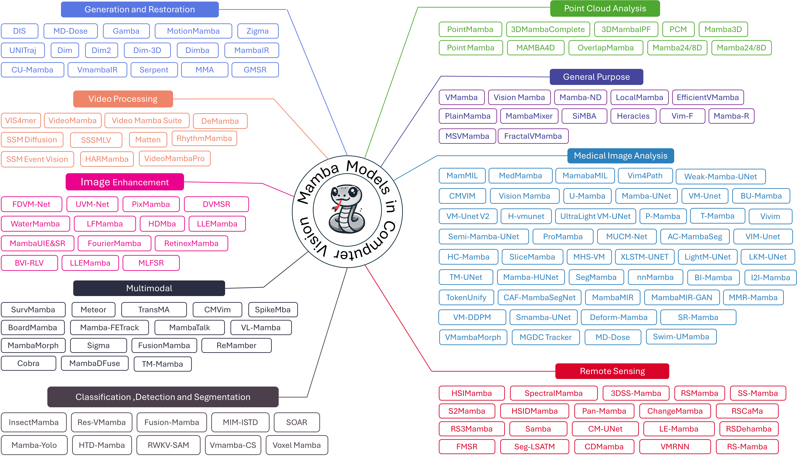

## Mamba in Vision: A Comprehensive Survey of Techniques and Applications [[Paper](https://arxiv.org/pdf/2410.03105)]

If you find this repository useful, please consider citing our paper:
```
@article{rahman2024mamba,
  title={Mamba in Vision: A Comprehensive Survey of Techniques and Applications},
  author={Md Maklachur Rahman and Abdullah Aman Tutul and Ankur Nath and Lamyanba Laishram and Soon Ki Jung and Tracy Hammond},
  journal={arXiv preprint arXiv:2410.03105},
  year={2024}
}
```

## Taxonomy


## Mamba in Computer Vision Applications

- [General Purpose](#general-purpose)
- [Image Classification, Object Detection, and Segmentation](#image-classification-object-detection-and-segmentation)
- [Image Enhancement](#image-enhancement)
- [Generation and Restoration](#generation-and-restoration)
- [Point Cloud Analysis](#point-cloud-analysis)
- [Video Processing](#video-processing)
- [Remote Sensing](#remote-sensing)
- [Medical Image Analysis](#medical-image-analysis)
  - [Medical Image Classification](#medical-image-classification)
  - [Medical Image Segmentation](#medical-image-segmentation)
    - [Medical 2D Image Segmentation](#medical-2d-image-segmentation)
    - [Medical 3D Image Segmentation](#medical-3d-image-segmentation)
  - [Medical Image Reconstruction](#medical-image-reconstruction)
  - [Other Tasks in Medical Imaging](#other-tasks-in-medical-imaging)
- [Multimodal](#multimodal)
- [Other Tasks](#other-tasks)

## General Purpose
- **SUM: Saliency Unification through Mamba for Visual Attention Modeling** - June 25, 2024, arXiv [[Paper](https://arxiv.org/abs/2406.17815)] [[Code](https://github.com/Arhosseini77/SUM)] 

	<p><small><em>Saliency Unification through Mamba (SUM) combines Mamba's powerful long-range dependency modeling with U-Net. It offers a unified model for different image types and adapts dynamically through a novel Conditional Visual State Space (C-VSS) block. It works well across natural images, web pages, and even commercial images, making it a versatile solution for a wide range of visual data.</em></small></p>
  
- **Vim-F: Visual State Space Model Benefiting from Learning in the Frequency Domain** - May 29, 2024, arXiv [[Paper](https://arxiv.org/abs/2405.18679)] [[Code](https://github.com/yws-wxs/Vim-F)] 

	<p><small><em>Vim-F is an improved Vision Mamba (ViM) model that scans both frequency and spatial domains using Fast Fourier Transform (FFT) to capture a unified visual representation. By removing position embedding and using a convolutional stem for patch embedding, Vim-F enhances the model's ability to interpret spatial relationships and improves performance.</em></small></p>

- **FractalVMamba: Scalable Visual State Space Model with Fractal Scanning** - May 23, 2024, arXiv [[Paper](https://arxiv.org/abs/2405.14480)]

	<p><small><em>This paper addresses the limitations of linear scanning curves in SSMs for image patch serialization and proposes fractal scanning curves as a solution. Fractal curves preserve spatial proximity and adapt to different resolutions, improving SSMs' ability to model complex patterns.</em></small></p>

- **MSVMamba: Multi-Scale VMamba: Hierarchy in Hierarchy Visual State Space Model** - May 23, 2024, arXiv [[Paper](https://arxiv.org/abs/2405.14174)] [[Code](https://github.com/YuHengsss/MSVMamba)] 

	<p><small><em>Multi-Scale Vision Mamba (MSVMamba) improves the efficiency of SSMs in vision tasks by using a multi-scale 2D scanning technique. It also incorporates a Convolutional Feed-Forward Network (ConvFFN) to improve channel mixing.</em></small></p>

- **Mamba-R: Vision Mamba ALSO Needs Registers** - May 23, 2024, arXiv [[Paper](https://arxiv.org/abs/2405.14858)] [[Homepage](https://wangf3014.github.io/mambar-page/)] [[Code](https://github.com/wangf3014/Mamba-Reg)] 

	<p><small><em>This paper identifies artifacts in Vision Mamba's feature maps, particularly high-norm tokens in low-information background areas. To address this, it introduces register tokens into Vision Mamba, resulting in the new Mamba-R architecture. Key modifications include evenly inserting registers and recycling them for final predictions. Mamba-R produces cleaner, more focused feature maps.</em></small></p>

- **MambaMixer: Efficient Selective State Space Models with Dual Token and Channel Selection** - Mar 29, 2024, arXiv [[Paper](https://arxiv.org/abs/2403.19888)] [[Code](https://github.com/MambaMixer/M2)] 

	<p><small><em>MambaMixer is a new architecture with data-dependent weights that uses a dual selection mechanism across tokens and channels, called Selective Token and Channel Mixer. It allows layers to access early features directly. As a proof of concept, Vision MambaMixer (ViM2) and Time Series MambaMixer (TSM2) are evaluated and achieved competitive performance.</em></small></p>
	
- **Heracles: A Hybrid SSM-Transformer Model for High-Resolution Image and Time-Series Analysis** - Mar 26, 2024, arXiv [[Paper](https://arxiv.org/abs/2403.18063)] [[Code](https://github.com/badripatro/heracles)] 

	<p><small><em>Heracles addresses two key challenges in SSMs: instability in large networks and difficulty handling local image information. It combines a global state space model, a local convolutional network, and attention-based token interaction to stabilize scaling and improve local detail capture. This approach achieves SOTA performance on ImageNet and excels in both vision and time-series tasks.</em></small></p>

- **PlainMamba: Improving Non-Hierarchical Mamba in Visual Recognition** - March 26, 2024, arXiv [[Paper](https://arxiv.org/abs/2403.17695)] [[Code](https://github.com/ChenhongyiYang/PlainMamba)] 

	<p><small><em>PlainMamba, is a simple non-hierarchical SSM, designed for visual recognition tasks. It adapts the Mamba model's selective scanning process to images with a continuous 2D scanning process and direction-aware updating. PlainMamba is easy to scale, with constant width across layers and no special tokens. It performs strongly on visual tasks, particularly in high-resolution inputs requiring less computational power.</em></small></p>

- **SiMBA: Simplified Mamba-Based Architecture for Vision and Multivariate Time Series** - March 22, 2024, arXiv [[Paper](https://arxiv.org/abs/2403.15360)] [[Code](https://github.com/badripatro/Simba)] 

	<p><small><em>SiMBA combines Einstein FFT (EinFFT) for channel modeling with the Mamba block for sequence modeling. It addresses the stability issues of Mamba in large networks and outperforms existing SSMs across image and time-series benchmarks. It also establishes itself as the new SOTA SSM on ImageNet and various transfer learning and time-series benchmarks.</em></small></p>

- **EfficientVMamba: Atrous Selective Scan for Light Weight Visual Mamba** - March 15, 2024, arXiv [[Paper](https://arxiv.org/abs/2403.09977)] [[Code](https://github.com/TerryPei/EfficientVMamba)] 

	<p><small><em>EfficientVMamba is a light-weight visual SSM that combines an atrous-based selective scan approach with convolutional branches. It reduces computational complexity while capturing both global and local features. It also achieves competitive performance, notably improving Vim-Ti by 5.6% on ImageNet with fewer FLOPs</em></small></p>

- **LocalMamba: Visual State Space Model with Windowed Selective Scan** - March 14, 2024, arXiv [[Paper](https://arxiv.org/abs/2403.09338)] [[Code](https://github.com/hunto/LocalMamba)] 

	<p><small><em>This paper introduces a novel local scanning strategy for Vision Mamba (ViM) to better preserve 2D dependencies, improving sequence modeling for vision tasks. By dynamically optimizing scan directions for each network layer, the model significantly enhances performance, outperforming Vim-Ti by 3.1% on ImageNet with the same 1.5G FLOPs.</em></small></p>

- **Mamba-ND: Selective State Space Modeling for Multi-Dimensional Data** - February 8, 2024, arXiv [[Paper](https://arxiv.org/abs/2402.05892)] [[Code](https://github.com/jacklishufan/Mamba-ND)] 
	
	<p><small><em>Mamba-ND is a generalized version of the Mamba architecture for multi-dimensional data. It unravels input data across dimensions using row-major orderings and achieves competitive performance on benchmarks such as ImageNet-1K, HMDB-51, and ERA5, while maintaining efficient scalability compared to self-attention models.</em></small></p>
	
- **VMamba: Visual State Space Model** - January 18, 2024, arXiv [[Paper](https://arxiv.org/abs/2401.10166)[[Code](https://github.com/MzeroMiko/VMamba)] 

	<p><small><em>VMamba addresses the challenge of adapting state-space models to 2D vision data by introducing the 2D Selective Scan (SS2D) module, which enables efficient context gathering across different scanning routes. This solution bridges the gap between 1D scans and the non-sequential structure of 2D images, improving input scaling efficiency and performance in visual perception tasks.</em></small></p>

- **Vision Mamba: Efficient Visual Representation Learning with Bidirectional State Space Model** - January 17, 2024, arXiv [[Paper](https://arxiv.org/abs/2401.09417)] [[Code](https://github.com/hustvl/Vim)] 

	<p><small><em>This paper addresses the challenge of position-sensitivity and global context in SSMs for visual data by introducing Vim, a vision backbone using bidirectional Mamba blocks. Vim replaces self-attention with bidirectional SSMs, improving visual representation learning while enhancing computational and memory efficiency.</em></small></p>
	
  
## Image Classification, Object Detection, and Segmentation (General)

### Image Classification
- **Res-VMamba: Fine-Grained Food Category Visual Classification Using Selective State Space Models with Deep Residual Learning** - February 24, 2024, arXiv [[Paper](https://arxiv.org/abs/2402.15761)] [[Code](https://github.com/ChiShengChen/ResVMamba)] 

	<p><small><em>This paper tackles the challenge of fine-grained food classification by integrating a residual learning framework into the VMamba model. It enhances both global and local state features, improving classification accuracy to 79.54% without pretrained weights, surpassing current SOTA models on the CNFOOD-241 dataset.</em></small></p>
	
- **InsectMamba: Insect Pest Classification with State Space Model** - April 4, 2024, arXiv [[Paper](https://arxiv.org/abs/2404.03611)]
	<p><small><em>This paper addresses the challenge of fine-grained pest classification by introducing InsectMamba, a model that combines SSMs, CNNs, MSA, and MLPs within Mix-SSM blocks. This integration enhances feature extraction for pest identification, overcoming issues like camouflage and species diversity.</em></small></p>
	

### Object Detection
- **RWKV-SAM: Mamba or RWKV: Exploring High-Quality and High-Efficiency Segment Anything Model** - June 27, 2024, arXiv [[Paper](https://arxiv.org/abs/2406.19369)] [[Code](https://github.com/HarborYuan/ovsam)] 

	<p><small><em>RWKV-SAM solves the challenge of efficient segmentation for high-resolution images by using a mixed backbone with convolution and RWKV operations. It provides high accuracy and efficiency, surpassing transformer and Mamba-based models with more than 2x speedup and improved segmentation quality across multiple datasets.</em></small></p>

- **Voxel Mamba: Group-Free State Space Models for Point Cloud-based 3D Object Detection** - June 15, 2024, arXiv [[Paper](https://arxiv.org/abs/2406.10700)] [[Code](https://github.com/gwenzhang/Voxel-Mamba)] 

	<p><small><em>Voxel Mamba solves the challenge of maintaining spatial proximity in 3D voxel serialization by using a group-free strategy with SSMs. It enhances spatial coherence with a Dual-scale SSM Block and positional encoding to achieve higher accuracy and efficiency in 3D object detection.</em></small></p>
	
- **Mamba-YOLO: SSMs-Based YOLO For Object Detection** - June 9, 2024, arXiv [[Paper](https://arxiv.org/abs/2406.05835)] [[Code](https://github.com/HZAI-ZJNU/Mamba-YOLO)] 

	<p><small><em>Mamba-YOLO addresses the computational burden of Transformer-based object detection models by leveraging SSMs to reduce quadratic complexity. It introduces LSBlock and RGBlock to improve local image dependency capture, enhancing both precision and robustness. Mamba-YOLO outperforms existing YOLO models on COCO and VOC datasets.</em></small></p>
	
- **SOAR: Advancements in Small Body Object Detection for Aerial Imagery Using State Space Models and Programmable Gradients** - May 2, 2024, arXiv [[Paper](https://arxiv.org/abs/2405.01699)] [[Code](https://github.com/yash2629/S.O.A.R)] 

	<p><small><em>This paper addresses the challenge of small object detection in aerial imagery by introducing two novel approaches: the SAHI framework on YOLO v9 with Programmable Gradient Information (PGI) to reduce information loss, and a Vision Mamba model with position embeddings and a bidirectional SSM for enhanced visual context modeling. These methods significantly improve detection accuracy and efficiency in real-time aerial scenarios.</em></small></p>
	
### Segmentation
- **Chen et al. (2024): Vision Mamba-based autonomous crack segmentation on concrete, asphalt, and masonry surfaces** - June 24, 2024, arXiv [[Paper](https://arxiv.org/abs/2406.16518)]

	<p><small><em>They introduce a VMamba-based framework for crack segmentation. The proposed encoder-decoder network achieves up to 2.8% higher mDS with 15.6% - 74.5% fewer parameters than CNNs and comparable performance to Transformers, while reducing floating-point operations by up to 90.6%.</em></small></p>
	
- **HTD-Mamba: Efficient Hyperspectral Target Detection with Pyramid State Space Model** - July 9, 2024, arXiv [[Paper](https://arxiv.org/abs/2407.06841)] [[Code](https://github.com/shendb2022/HTD-Mamba)] 

	<p><small><em>HTD-Mamba is an efficient self-supervised method for hyperspectral target detection that uses spectrally contrastive learning, spatial-encoded spectral augmentation, and a pyramid SSM to model long-range dependencies and capture multiresolution features. It outperforms SOTA methods on four public datasets.</em></small></p>

- **Fusion-Mamba: Efficient Image Fusion with State Space Model** - April 11, 2024, arXiv [[Paper](https://arxiv.org/abs/2404.07932)]
	
	<p><small><em>FusionMamba is an efficient image fusion method that leverages Mamba blocks in U-shaped networks to extract spatial and spectral features independently. The FusionMamba block combines dual inputs for better fusion, outperforming existing techniques. It achieves SOTA performance across multiple image fusion tasks.</em></small></p>

- **MiM-ISTD: Mamba-in-Mamba for Efficient Infrared Small Target Detection** - March 4, 2024, arXiv [[Paper](https://arxiv.org/abs/2403.02148)] [[Code](https://github.com/txchen-USTC/MiM-ISTD)] 

	<p><small><em>MiM-ISTD is an efficient infrared small target detection method that combines Outer and Inner Mamba blocks to capture both global and local features. It achieves 8× faster performance and reduces GPU memory usage by 62.2% compared to SOTA methods on high-resolution infrared images.</em></small></p>

## Image Enhancement

- **BVI-RLV: A Fully Registered Dataset and Benchmarks for Low-Light Video Enhancement** - July 3, 2024, arXiv [[Paper](https://arxiv.org/abs/2407.03535)] [[Code](https://ieee-dataport.org/open-access/bvi-lowlight-fully-registered-datasets-low-light-image-and-video-enhancement)] 

	<p><small><em>This paper introduces a new low-light video dataset with 40 scenes, capturing genuine noise and temporal artifacts. The dataset provides fully registered ground truth data for pixel-wise frame alignment. Benchmarks using CNNs, transformers, diffusion models, and Mamba show improved performance for low-light video enhancement (LLVE) compared to existing datasets.</em></small></p>
	
- **MLFSR: Mamba-based Light Field Super-Resolution with Efficient Subspace Scanning** - June 23, 2024, arXiv [[Paper](https://arxiv.org/abs/2406.16083)]

	<p><small><em>MLFSR is a Mamba-based Light Field Super-Resolution method that introduces an efficient subspace scanning strategy to tokenize and process 4D LFs. It captures global and local details using a Mamba-based Global Interaction module and Spatial-Angular Modulator. MLFSR outperforms CNN-based models and rivals Transformers while offering faster inference and lower memory usage.</em></small></p>

- **LFMamba: Light Field Image Super-Resolution with State Space Model** - June 18, 2024, arXiv [[Paper](https://arxiv.org/abs/2406.12463)]

	<p><small><em>LFMamba is an SSM-based network for light field super-resolution that addresses the challenges in 4D light fields. By using SSMs with an SS2D mechanism on 2D slices of 4D LFs, it efficiently models spatial, angular, and structural information. LFMamba outperforms existing methods on LF benchmarks and demonstrates strong generalization in ablation studies.</em></small></p>
	
- **HDMba: Hyperspectral Remote Sensing Imagery Dehazing with State Space Model** - June 9, 2024, arXiv [[Paper](https://arxiv.org/abs/2406.05700)] [[Code](https://github.com/RsAI-lab/HDMba)] 

	<p><small><em>HDMba is the first Mamba-based network for hyperspectral image dehazing, addressing spatial visibility and spectral distortion challenges. It introduces a Window Selective Scan Module (WSSM) to capture both local dependencies and global correlations. HDMba outperforms SOTA methods in dehazing performance, as demonstrated on the Gaofen-5 HSI dataset.</em></small></p>
	
- **WaterMamba: Visual State Space Model for Underwater Image Enhancement** - May 14, 2024, arXiv [[Paper](https://arxiv.org/abs/2405.08419)]

	<p><small><em>WaterMamba is an SSM-based underwater image enhancement method. It introduces SCOSS blocks, combining pixel and channel information flow, and MSFFN for information flow adjustment. WaterMamba outperforms SOTA methods with fewer parameters and computational resources with improving generalizability.</em></small></p>
	
- **DVMSR: Distillated Vision Mamba for Efficient Super-Resolution** - May 11, 2024, arXiv [[Paper](https://arxiv.org/abs/2405.03008)] [[Code](https://github.com/nathan66666/DVMSR)] 

	<p><small><em>DVMSR is a lightweight Image Super-Resolution network that combines Vision Mamba with a distillation strategy. It uses Residual State Space Blocks (RSSBs) to balance efficiency and performance, leveraging teacher-student supervision. DVMSR outperforms SOTA efficient SR methods, maintaining high PSNR and SSIM with fewer parameters.</em></small></p>
	
- **FourierMamba: Fourier Learning Integration with State Space Models for Image Deraining** - May 29, 2024, arXiv [[Paper](https://arxiv.org/abs/2405.19450)]

	<p><small><em>FourierMamba introduces Mamba into the Fourier space for image deraining, correlating low and high frequencies to improve performance. It uses zigzag coding to rearrange frequencies in the spatial dimension and directly applies Mamba in the channel dimension for enhanced frequency correlation. This approach leverages frequency information more effectively for superior image deraining.</em></small></p>

- **RetinexMamba: Retinex-based Mamba for Low-light Image Enhancement** - May 6, 2024, arXiv [[Paper](https://arxiv.org/abs/2405.03349)] [[Code](https://github.com/YhuoyuH/RetinexMamba)] 

	<p><small><em>RetinexMamba combines traditional Retinex methods with deep learning, leveraging SSMs for efficient low-light image enhancement. It introduces Fused-Attention in place of IG-MSA for better interpretability and performance. RetinexMamba outperforms existing Retinex-based methods on the LOL dataset.</em></small></p>

- **SRODT: Sparse Reconstruction of Optical Doppler Tomography Based on State Space Model** - April 26, 2024, arXiv [[Paper](https://arxiv.org/abs/2404.17484)]

	<p><small><em>This paper introduces a novel sparse reconstruction framework for Optical Doppler Tomography (ODT) that reduces computational and storage demands. It integrates magnitude-phase fusion, SSM-based representation learning, an Inception-based Feedforward Network (IncFFN), and a B-line Pixel Shuffle (BPS) layer for improved reconstruction accuracy. This is the first application of SSM in image reconstruction, showing promising results in real-world animal data.</em></small></p>

-  **MambaUIE&SR: Unraveling the Ocean's Secrets with Only 2.8 GFLOPs** - April 22, 2024, arXiv [[Paper](https://arxiv.org/abs/2404.13884)] [[Code](https://github.com/1024AILab/MambaUIE)] 

	<p><small><em>MambaUIE is an SSM-based underwater image enhancement model that efficiently synthesizes global and local information using Visual State Space (VSS) blocks, a Dynamic Interaction Block (DIB), and a Spatial Feed-Forward Network (SGFN). It reduces GFLOPs by 67.4% while maintaining high accuracy, outperforming SOTA methods on the UIEB dataset.</em></small></p>
	
- **PixMamba: Leveraging State Space Models in a Dual-Level Architecture for Underwater Image Enhancement** - April 12, 2024, arXiv [[Paper](https://arxiv.org/abs/2406.08444)] [[Code](https://github.com/weitunglin/pixmamba)] 

	<p><small><em>It is a novel underwater image enhancement architecture that uses SSMs for efficient global dependency modeling. It combines patch-level EMNet for image reconstruction and pixel-level PixNet for fine-grained feature capturing, overcoming challenges of color distortion and blurring.</em></small></p>

- **LLEMamba: Low-Light Enhancement via Relighting-Guided Mamba with Deep Unfolding Network** - March 3, 2024, arXiv [[Paper](https://arxiv.org/abs/2406.01028)]

	<p><small><em>LLEMamba is a low-light enhancement method that combines Retinex optimization with Mamba deep priors for efficient global context modeling. By embedding the optimization process in a deep unfolding network, LLEMamba reduces computational complexity compared to Transformer-based methods, improving interpretability and minimizing distortion.</em></small></p>
	
- **UVM-Net: U-shaped Vision Mamba for Single Image Dehazing** - February 15, 2024, arXiv [[Paper](https://arxiv.org/abs/2402.04139)] [[Code](https://github.com/zzr-idam/UVM-Net)] 

	<p><small><em>UVM-Net is an efficient image dehazing network that combines the local feature extraction of convolutional layers with the long-range dependency handling of SSMs. Using a Bi-SSM block, UVM-Net reduces computational complexity while maintaining high performance, achieving 100FPS on 325×325 resolution images.</em></small></p>

- **FDVM-Net: FD-Vision Mamba for Endoscopic Exposure Correction** - February 14, 2024, arXiv [[Paper](https://arxiv.org/abs/2402.06378)] [[Code](https://github.com/zzr-idam/FDV-NET)] 

	<p><small><em>FDVM-Net is a frequency-domain-based network for endoscopic image exposure correction, utilizing C-SSM blocks to combine convolutional local feature extraction with SSM's long-range dependency handling. The two-path architecture processes phase and amplitude information separately to reconstruct high-quality images.</em></small></p>

## Generation and Restoration

- **DiM-3D: Efficient 3D Shape Generation via Diffusion Mamba with Bidirectional SSMs** - June 7, 2024, arXiv [[Paper](https://arxiv.org/abs/2406.05038)]

	<p><small><em>DiM-3D addresses the scalability challenges in 3D shape generation by replacing traditional self-attention mechanisms with Mamba's efficient sequence modeling. This approach reduces the cubic complexity of attention operations, enabling fast and efficient high-resolution 3D point cloud generation and point cloud completion.</em></small></p>

- **Dimba: Transformer-Mamba Diffusion Models** - June 3, 2024, arXiv [[Paper](https://arxiv.org/abs/2406.01159)] [[Homepage](https://dimba-project.github.io/)] [[Code](https://github.com/feizc/Dimba)] 

	<p><small><em>Dimba addresses the efficiency challenge in text-to-image generation by combining Transformer and Mamba layers in a hybrid architecture. This design reduces memory usage and boosts throughput while maintaining image quality and semantic control. Dimba shows comparable performance to Transformer-based models, highlighting the potential of hybrid architectures for large-scale diffusion models.</em></small></p>

- **UniTraj: Deciphering Movement: Unified Trajectory Generation Model for Multi-Agent** - May 27, 2024, arXiv [[Paper](https://arxiv.org/abs/2405.17680)] [[Code](https://github.com/colorfulfuture/UniTraj-pytorch)] 

	<p><small><em>UniTraj addresses the challenge of multi-agent trajectory tasks by introducing a unified model capable of handling trajectory prediction, imputation, and spatial-temporal recovery. It uses Ghost Spatial Masking (GSM) for spatial feature extraction and Bidirectional Temporal Mamba to capture temporal dependencies. UniTraj outperforms on diverse sports datasets and mark as the first versatile framework for multi-agent trajectory generation.</em></small></p>

- **DiM2: Scaling Diffusion Mamba with Bidirectional SSMs for Efficient Image and Video Generation** - May 24, 2024, arXiv [[Paper](https://arxiv.org/abs/2405.15881)]

	<p><small><em>It solves the challenge of high computational complexity in image generation by replacing self-attention with the scalable Mamba architecture. DiM maintains linear complexity, reduces inference time, and outperforms diffusion transformers in image and video generation.</em></small></p>


- **DiM: Diffusion Mamba for Efficient High-Resolution Image Synthesis** - May 23, 2024, arXiv [[Paper](https://arxiv.org/abs/2405.14224)] [[Code](https://github.com/tyshiwo1/DiM-DiffusionMamba/)] 

	 DiM improves high-resolution image generation by using Mamba's efficient state space modeling with diffusion models. It introduces multi-directional scans and local feature enhancement to handle 2D signals, offering faster training and inference. It supports training-free upsampling for even higher resolutions.

-  **GMSR: Gradient-Guided Mamba for Spectral Reconstruction from RGB Images** - May 13, 2024, arXiv [[Paper](https://arxiv.org/abs/2405.07777)] [[Code](https://github.com/wxy11-27/GMSR)] 

	<p><small><em>GMSR-Net is a lightweight spectral reconstruction model that leverages Mamba's global receptive field and linear complexity for efficient RGB-to-spectral conversion. It introduces Gradient Mamba (GM) blocks with spatial and spectral gradient attention to enhance feature reconstruction. GMSR-Net achieves SOTA performance while reducing parameters and FLOPs by 10x and 20x, respectively.</em></small></p>

- **CU-Mamba: Selective State Space Models with Channel Learning for Image Restoration** - April 17, 2024, arXiv [[Paper](https://arxiv.org/abs/2404.11778)]

	<p><small><em>CU-Mamba is a U-Net-based image restoration model that integrates a dual SSM framework for efficient long-range dependency modeling. It uses Spatial SSM for global context and Channel SSM to preserve channel correlations, both with linear computational complexity. CU-Mamba outperforms existing methods, highlighting the benefits of combining spatial and channel contexts.</em></small></p>

- **ZigMa: A DiT-style Zigzag Mamba Diffusion Model** - April 1, 2024, arXiv [[Paper](https://arxiv.org/abs/2403.13802)] [[Homepage](https://taohu.me/zigma/)] [[Code](https://github.com/CompVis/zigma)] 

	<p><small><em>Zigzag Mamba addresses scalability and quadratic complexity issues in diffusion models by improving Mamba’s scan scheme for spatial continuity. This zero-parameter method enhances speed and memory efficiency compared to Transformer-based models. Integrated with the Stochastic Interpolant framework, Zigzag Mamba shows improved scalability on large-resolution datasets like FacesHQ and MS COCO.</em></small></p>

- **T-Mamba: Frequency-Enhanced Gated Long-Range Dependency for Tooth 3D CBCT Segmentation** - April 1, 2024, arXiv [[Paper](https://arxiv.org/abs/2404.01065)] [[Code](https://github.com/isbrycee/T-Mamba)] 

	<p><small><em>T-Mamba is a tooth segmentation model that integrates frequency-based features and bi-positional encoding into Vision Mamba to improve global feature modeling efficiency. It adapts to both 2D and 3D tooth data and sets new SOTA results on public tooth CBCT and TED3 datasets.</em></small></p>

- **Gamba: Marry Gaussian Splatting with Mamba for Single View 3D Reconstruction** - March 29, 2024, arXiv [[Paper](https://arxiv.org/abs/2403.18795)]

	<p><small><em>Gamba is an end-to-end 3D reconstruction model that rapidly generates 3D assets from single-view images, leveraging a Mamba-based GambaFormer network for efficient Gaussian Splatting (3DGS). It achieves linear scalability and eliminates warmup supervision, significantly outperforming optimization-based methods with a 0.05-second reconstruction speed, 1,000× faster on a single NVIDIA A100 GPU.</em></small></p>

- **Serpent: Scalable and Efficient Image Restoration via Multi-scale Structured State Space Models** - March 26, 2024, arXiv [[Paper](https://arxiv.org/abs/2403.17902)]

	<p><small><em>Serpent is an efficient image restoration architecture that combines SSMs with multi-scale signal processing to capture global dependencies with linear complexity. It reduces computational cost by up to 150× in FLOPS and 5× in GPU memory while maintaining SOTA reconstruction quality, particularly excelling in high-resolution image restoration.</em></small></p>

- **MambaIR: A Simple Baseline for Image Restoration with State-Space Model** - March 25, 2024, arXiv [[Paper](https://arxiv.org/abs/2402.15648)] [[Code](https://github.com/csguoh/MambaIR)] 

	<p><small><em>MambaIR enhances the Mamba architecture for image restoration by adding local enhancement and channel attention, solving issues like pixel forgetting and channel redundancy. It outperforms SwinIR by up to 0.45dB in super-resolution, offering better performance with similar computational costs.</em></small></p>

- **MotionMamba: Efficient and Long Sequence Motion Generation with Hierarchical and Bidirectional Selective SSM** - March 19, 2024, arXiv [[Paper](https://arxiv.org/abs/2403.07487)] [[Homepage](https://steve-zeyu-zhang.github.io/MotionMamba/)] [[Code](https://github.com/steve-zeyu-zhang/MotionMamba/)] 

	<p><small><em>Motion Mamba is an efficient human motion generation model built on SSMs, featuring a Hierarchical Temporal Mamba (HTM) block for temporal data and a Bidirectional Spatial Mamba (BSM) block for latent pose processing. It improves FID by up to 50% and is 4× faster than previous methods on the HumanML3D and KIT-ML datasets, excelling in long-sequence motion generation.</em></small></p>

- **VmambaIR: Visual State Space Model for Image Restoration** - March 17, 2024, arXiv [[Paper](https://arxiv.org/abs/2403.11423)] [[Code](https://github.com/AlphacatPlus/VmambaIR)] 

	<p><small><em>VmambaIR introduces Omni Selective Scan (OSS) blocks to model image information in all six directions to overcome SSM limitations. It achieves SOTA performance in tasks like deraining and super-resolution, using fewer computational resources compared to CNNs, Transformers, and diffusion models.</em></small></p>

- **MMA: Activating Wider Areas in Image Super-Resolution** - March 13, 2024, arXiv [[Paper](https://arxiv.org/abs/2403.08330)] [[Code]([https://github.com/MMA-Lab/MMA](https://github.com/ArsenalCheng/MMA))] 

	<p><small><em>MMA is a Vision Mamba (Vim)-based model for single-image super-resolution (SISR) that integrates a MetaFormer-style block, pre-training on larger datasets, and complementary attention mechanisms. MMA outperforms SOTA SISR methods, achieving a 0.5 dB PSNR gain on the Manga109 dataset with low memory and computational overhead.</em></small></p>

- **DiS: Scalable Diffusion Models with State Space Backbone** - February 8, 2024, arXiv [[Paper](https://arxiv.org/abs/2402.05608)] [[Code](https://github.com/feizc/DiS)] 

	<p><small><em>Diffusion State Space Models (DiS) replace the traditional U-Net backbone with a state space backbone. DiS treats time, conditions, and noisy image patches as tokens, which achieve comparable performance to CNN and Transformer-based models.</em></small></p>

## Point Cloud Analysis

- **Mamba24/8D: Enhancing Global Interaction in Point Clouds via State Space Model** - June 25, 2024, arXiv [[Paper](https://arxiv.org/abs/2406.17442)]

	<p><small><em>Mamba24/8D introduces a multi-path serialization strategy for point clouds and a ConvMamba block to enhance local geometry modeling. It achieves SOTA results on tasks like ScanNet v2, ScanNet200, and nuScenes, with improved global modeling and linear complexity.</em></small></p>

- **PointABM: Integrating Bidirectional State Space Model with Multi-Head Self-Attention for Point Cloud Analysis** - June 10, 2024, arXiv [[Paper](https://arxiv.org/abs/2406.06069)]

	<p><small><em>PointABM is a hybrid model that integrates Mamba with Transformer to improve local and global feature extraction for 3D point cloud analysis. It introduces a bidirectional SSM (bi-SSM) and leverages Transformer’s self-attention to enhance feature capture. The combination significantly improves performance in 3D point cloud analysis.</em></small></p>

- **PoinTramba: A Hybrid Transformer-Mamba Framework for Point Cloud Analysis** - May 24, 2024, arXiv [[Paper](https://arxiv.org/abs/2405.15463)] [[Code](https://github.com/xiaoyao3302/PoinTramba)] 

	<p><small><em>PoinTramba is a hybrid framework combining the Transformer’s strength in capturing intra-group dependencies with Mamba’s computational efficiency for inter-group analysis in point cloud tasks. It introduces a bi-directional importance-aware ordering (BIO) strategy to enhance performance and set a new SOTA on datasets like ScanObjectNN, ModelNet40, and ShapeNetPart.</em></small></p>

- **MAMBA4D: Efficient Long-Sequence Point Cloud Video Understanding with Disentangled Spatial-Temporal State Space Models** - May 23, 2024, arXiv [[Paper](https://arxiv.org/abs/2405.14338)]

	<p><small><em>This paper presents a 4D point cloud video backbone using SSMs with Intra-frame Spatial and Inter-frame Temporal Mamba blocks.to address the high computational cost of transformer-based architectures. It reduces GPU memory by 87.5%, speeds up processing by 5.36×, and improves accuracy by up to 10.4% on the MSR-Action3D dataset compared to transformer-based methods.</em></small></p>

- **OverlapMamba: Novel Shift State Space Model for LiDAR-based Place Recognition** - May 13, 2024, arXiv [[Paper](https://arxiv.org/abs/2405.07966)]

	<p><small><em>OverlapMamba is a novel place recognition model that represents input range views (RVs) as sequences using SSM. It employs a stochastic reconstruction approach for efficient visual representation, outperforming LiDAR-based methods while showing robustness in loop closure detection across multiple datasets.</em></small></p>

- **Mamba3D: Enhancing Local Features for 3D Point Cloud Analysis via State Space Model** - April 23, 2024, arXiv [[Paper](https://arxiv.org/abs/2404.14966)] [[Code](https://github.com/xhanxu/Mamba3D)] 

	<p><small><em>Mamba3D improves local feature extraction with Local Norm Pooling (LNP) and global features with bidirectional SSM (bi-SSM). It outperforms Transformer-based models, including 92.6% accuracy on ScanObjectNN and 95.1% on ModelNet40, with linear complexity.</em></small></p>

- **3DMambaComplete: Exploring Structured State Space Model for Point Cloud Completion** - April 10, 2024, arXiv [[Paper](https://arxiv.org/abs/2404.07106)]

	<p><small><em>3DMambaComplete is a point cloud completion network built on the Mamba framework, addressing local detail loss and computational complexity. It uses HyperPoint Generation, HyperPoint Spread, and a deformation method to reconstruct fine-grained 3D structures.</em></small></p>

- **3DMambaIPF: A State Space Model for Iterative Point Cloud Filtering via Differentiable Rendering** - April 8, 2024, arXiv [[Paper](https://arxiv.org/abs/2404.05522)]

	<p><small><em>3DMambaIPF is a point cloud filtering method that leverages Mamba's selective SSM architecture for large-scale point clouds. It integrates a fast differentiable rendering loss to improve visual realism and denoising accuracy. 3DMambaIPF achieves SOTA results on small and large-scale datasets, effectively handling models with up to 500K points, where other methods struggle.</em></small></p>

- **PointMamba: A Simple State Space Model for Point Cloud Analysis** - April 2, 2024, arXiv [[Paper](https://arxiv.org/abs/2402.10739)] [[Code](https://github.com/LMD0311/PointMamba)] 

	<p><small><em>PointMamba is a linear complexity point cloud analysis model based on the Mamba architecture, offering global modeling with reduced computational costs. It uses space-filling curves for point tokenization and a non-hierarchical Mamba encoder.</em></small></p>

- **Point Mamba: A Novel Point Cloud Backbone Based on State Space Model with Octree-Based Ordering Strategy** - March 17, 2024, arXiv [[Paper](https://arxiv.org/abs/2403.06467)] [[Code](https://github.com/IRMVLab/Point-Mamba)] 

	<p><small><em>Point Mamba is an SSM-based point cloud processing model with a causality-aware ordering mechanism using an octree-based z-order strategy to handle irregular points. It achieves 93.4% accuracy on ModelNet40 and 75.7 mIOU on ScanNet with linear complexity compared to transformer-based methods.</em></small></p>

- **Point Cloud Mamba (PCM): Point Cloud Learning via State Space Model** - March 1, 2024, arXiv [[Paper](https://arxiv.org/abs/2403.00762)] [[Code](https://github.com/SkyworkAI/PointCloudMamba)] 

	<p><small><em>Point Cloud Mamba solves the challenge of converting 3D point clouds into sequences while preserving spatial relationships using a Consistent Traverse Serialization method. It introduces point prompts to guide Mamba in handling different sequence orders and positional encoding for better spatial information. It achieves 82.6 mIoU on S3DIS and outperforms DeLA and PTv3 by 8.5 and 7.9 mIoU.</em></small></p>


## Video Processing

- **VideoMambaPro: A Leap Forward for Mamba in Video Understanding** - June 27, 2024, arXiv [[Paper](https://arxiv.org/abs/2406.19006)] [[Code](https://github.com/hotfinda/VideoMambaPro)] 

	<p><small><em>VideoMambaPro addresses two key limitations of Mamba—historical decay and element contradiction—by introducing masked backward computation and elemental residual connections. This improves spatio-temporal representation in video understanding tasks. VideoMambaPro surpasses both transformers and VideoMamba, achieving SOTA performance with significantly fewer parameters, notably 91.9% top-1 on Kinetics-400.</em></small></p>

- **SSM-Based Event Vision: State Space Models for Event Cameras** - CVPR 2024 [[Paper](https://openaccess.thecvf.com/content/CVPR2024/papers/Zubic_State_Space_Models_for_Event_Cameras_CVPR_2024_paper.pdf)] [[Code](https://github.com/uzh-rpg/ssms_event_cameras)] 

	<p><small><em>This paper introduces SSMs with learnable timescale parameters for event-based vision, allowing frequency adaptation without retraining. It also addresses aliasing effects at higher frequencies. SSMs outperform RNNs and Transformers, training 33% faster and showing minimal performance drops on Gen1 and 1 Mpx datasets.</em></small></p>

- **DeMamba: AI-Generated Video Detection on Million-Scale GenVideo Benchmark** - May 30, 2024, arXiv [[Paper](https://arxiv.org/abs/2405.19707)] [[Code](https://github.com/chenhaoxing/DeMamba)] 

	<p><small><em>GenVideo is the first large-scale AI-generated video detection dataset, featuring over one million real and AI-generated videos. It offers diverse video categories and generation techniques. The study introduces two evaluation methods and the Detail Mamba (DeMamba) module, which improves detector generalizability and robustness.</em></small></p>

- **Matten: Video Generation with Mamba-Attention** - May 5, 2024, arXiv [[Paper] (https://arxiv.org/abs/2405.03025)]

	<p><small><em>Matten is a latent diffusion model with Mamba-Attention architecture for video generation. It combines spatial-temporal attention for local content modeling and bidirectional Mamba for global content modeling. Matten outperforms ViT and GAN-based models, with strong scalability for improved video quality.</em></small></p>

- **RhythmMamba: Fast Remote Physiological Measurement with Arbitrary Length Videos** - April 9, 2024, arXiv [[Paper](https://arxiv.org/abs/2404.06483)] [[Code](https://github.com/zizheng-guo/RhythmMamba)] 

	<p><small><em>RhythmMamba is an end-to-end Mamba-based method for remote photoplethysmography (rPPG), addressing spatiotemporal redundancy and periodic pattern recognition. It uses multi-temporal Mamba and frequency domain feed-forward to capture rPPG signals efficiently. It works on video segments of any length.</em></small></p>

- **VideoMamba Suite: State Space Model as a Versatile Alternative for Video Understanding** - March 14, 2024, arXiv [[Paper](https://arxiv.org/abs/2403.09626)] [[Code](https://github.com/OpenGVLab/video-mamba-suite)] 

	<p><small><em>This study explores Mamba as a potential alternative to Transformers for video understanding, evaluating 14 models across 12 tasks. Mamba demonstrates strong performance in video-only and video-language tasks, with efficient performance trade-offs.</em></small></p>

- **SSM Diffusion: SSM Meets Video Diffusion Models: Efficient Long-Term Video Generation with Structured State Spaces** - March 12, 2024, arXiv [[Paper](https://arxiv.org/abs/2403.07711)] [[Code](https://github.com/shim0114/SSM-Meets-Video-Diffusion-Models)] 

	<p><small><em>This paper introduces Mamba as efficient alternatives to attention layers for video generation in diffusion models. It offers linear memory usage and better performance on long sequences. Bidirectional SSMs improve temporal feature extraction and outperforms attention-based models on datasets like MineRL Navigate_

- **VideoMamba: State Space Model for Efficient Video Understanding** - March 9, 2024, arXiv [[Paper](https://arxiv.org/abs/2403.06977)] [[Code](https://github.com/OpenGVLab/VideoMamba)] 

	<p><small><em>VideoMamba adapts Mamba for video understanding with linear complexity for efficient long-term modeling. It offers scalability, excels in short-term action recognition, and outperforms 3D CNNs and transformers in long-term video tasks and multi-modal compatibility.</em></small></p>

- **SSSMLV: Selective Structured State-Spaces for Long-Form Video Understanding** - CVPR 2023, arXiv [[Paper](https://openaccess.thecvf.com/content/CVPR2023/html/Wang_Selective_Structured_State-Spaces_for_Long-Form_Video_Understanding_CVPR_2023_paper.html)]

	<p><small><em> It is one of the initial models. The Selective S4 (S5) model improves the efficiency and accuracy of long-form video understanding by using a lightweight mask generator to adaptively select important image tokens. It uses a novel long-short masked contrastive learning approach for better temporal context prediction.</em></small></p>

- **ViS4mer: Video Synthesis Framework with Mamba-Based Attention Mechanism** - ECCV 2022 [[Paper](https://link.springer.com/chapter/10.1007/978-3-031-19833-5_6)] [[Code](https://github.com/md-mohaiminul/ViS4mer)] 

	<p><small><em>ViS4mer is the first model to use SSM for long-range video modeling, combining self-attention for short-range features with S4 layers for long-range temporal reasoning. It is 2.63× faster, uses 8× less memory, and achieves SOTA results on LVU and competitive performance on the Breakfast and COIN datasets.</em></small></p>
	
## Remote Sensing
- **Seg-LSTM: Performance of xLSTM for Semantic Segmentation of Remotely Sensed Images** - June 20, 2024, arXiv [[Paper](https://arxiv.org/abs/2406.14086)] [[Code](https://github.com/zhuqinfeng1999/Seg-LSTM)] 

	<p><small><em>This is the first attempt to evaluate the effectiveness of Vision-LSTM in semantic segmentation of remotely sensed images. It uses specifically designed encoder-decoder architecture.</em></small></p>

- **PyramidMamba: Rethinking Pyramid Feature Fusion with Selective Space State Model for Semantic Segmentation of Remote Sensing Imagery** - June 16, 2024, arXiv [[Paper](https://arxiv.org/abs/2406.10828)] [[Code](https://github.com/WangLibo1995/GeoSeg)] 

	<p><small><em>It is a Mamba-based segmentation network designed to address semantic redundancy in multi-scale feature fusion for remote sensing images. It introduces a dense spatial pyramid pooling (DSPP) and pyramid fusion Mamba (PFM) to enhance multi-scale feature representation. PyramidMamba achieves SOTA performance on OpenEarthMap, ISPRS Vaihingen, and Potsdam datasets.</em></small></p>

- **CDMamba: Remote Sensing Image Change Detection with Mamba** - June 6, 2024, arXiv [[Paper](https://arxiv.org/abs/2406.04207)] [[Code](https://github.com/zmoka-zht/CDMamba)] 

	<p><small><em>CDMamba enhances remote sensing change detection by combining global and local features using a Scaled Residual ConvMamba (SRCM) block. It improves fine detection by enhancing local details and introduces the Adaptive Global Local Guided Fusion (AGLGF) block for better bi-temporal feature interaction.</em></small></p>


- **3DSS-Mamba: 3DSS-Mamba: 3D-Spectral-Spatial Mamba for Hyperspectral Image Classification** - May 21, 2024, arXiv [[Paper](https://arxiv.org/abs/2405.12487)]

	<p><small><em>3DSS-Mamba is a hyperspectral image (HSI) classification framework, leveraging Mamba's efficient long-range modeling. It introduces a 3D-Spectral-Spatial Selective Scanning (3DSS) mechanism to handle high-dimensional HSI data, improving global spectral-spatial feature extraction.</em></small></p>

- **CM-UNet: Hybrid CNN-Mamba UNet for Remote Sensing Image Semantic Segmentation** - May 17, 2024, arXiv [[Paper](https://arxiv.org/abs/2405.10530)] [[Code](https://github.com/XiaoBuL/CM-UNet)] 

	<p><small><em>CM-UNet is a semantic segmentation model for remote sensing images, combining a CNN-based encoder for local feature extraction and a Mamba-based decoder for global information aggregation. It introduces the CSMamba block for improved global-local fusion and the MSAA module for multi-scale feature refinement.</em></small></p>

- **RSDehamba: Lightweight Vision Mamba for Remote Sensing Satellite Image Dehazing** - May 16, 2024, arXiv [[Paper](https://arxiv.org/abs/2405.10030)]

	<p><small><em>RSDhamba is a lightweight dehazing network for remote sensing images. It integrates the Selective SSM into a U-Net architecture. Here, the Vision Dehamba Block (VDB) enhances global context encoding, while the Direction-aware Scan Module (DSM) improves spatial dependency and channel information exchange.</em></small></p>

- **FMSR: Frequency-Assisted Mamba for Remote Sensing Image Super-Resolution** - May 8, 2024, arXiv [[Paper](https://arxiv.org/abs/2405.04964)]

	<p><small><em>FMSR is a super-resolution framework for remote sensing images. It uses a Frequency Selection Module (FSM), Vision State Space Module (VSSM), and Hybrid Gate Module (HGM) for spatial-frequency fusion. This model outperforms Transformer-based methods while significantly reducing memory and complexity.</em></small></p>

- **RSCaMa: Remote Sensing Image Change Captioning with State Space Model** - May 2, 2024, arXiv [[Paper](https://arxiv.org/abs/2404.18895)] [[Code](https://github.com/Chen-Yang-Liu/RSCaMa)] 

	<p><small><em>RSCaMa improves spatial and temporal modeling for Remote Sensing Image Change Captioning (RSICC) using Spatial Difference-aware SSM (SD-SSM) for spatial changes and Temporal-Traversing SSM (TT-SSM) for temporal interactions. It enhances spatial and temporal understanding and outperforms previous methods in the RSICC task.</em></small></p>

- **SS-Mamba: Spectral-Spatial Mamba for Hyperspectral Image Classification** - April 29, 2024, arXiv [[Paper](https://arxiv.org/abs/2404.18401)]

	<p><small><em>SS-Mamba is a spectral-spatial Mamba-based model for hyperspectral image (HSI) classification. It combines spectral-spatial token generation with Mamba blocks for efficient processing, overcoming Transformer's complexity issues.</em></small></p>

- **S^2 Mamba: A Spatial-spectral State Space Model for Hyperspectral Image Classification** - April 28, 2024, arXiv [[Paper](https://arxiv.org/abs/2404.18213)] [[Code](https://github.com/PURE-melo/S2Mamba)] 

	<p><small><em>S2Mamba is a spatial-spectral SSM for hyperspectral image classification. It uses separate models for spatial and spectral feature extraction, combined with a Spatial-Spectral Mixture Gate for optimal fusion. S2Mamba improves efficiency and accuracy in land cover analysis, outperforming other methods on HSI benchmarks.</em></small></p>

- **HSIDMamba: Exploring Bidirectional State-Space Models for Hyperspectral Denoising** - April 15, 2024, arXiv [[Paper](https://arxiv.org/abs/2404.09697)]

	<p><small><em>HSIDMamba is a hyperspectral image denoising model leveraging Mamba's linear complexity to efficiently capture spatial-spectral dependencies. It introduces Bidirectional Continuous Scanning Mechanism (BCSM) to enhance spatial-spectral interactions and improve denoising. HSDM It surpasses transformer-based models by 30% in efficiency.</em></small></p>

- **ChangeMamba: Remote Sensing Change Detection with Spatio-Temporal State Space Model** - April 14, 2024, arXiv [[Paper](https://arxiv.org/abs/2404.03425)] [[Code](https://github.com/ChenHongruixuan/MambaCD)] 

	<p><small><em>MambaBCD, MambaSCD, and MambaBDA are Mamba-based architectures designed for binary change detection, semantic change detection, and building damage assessment. These frameworks leverage Mamba’s ability to capture global spatial context with linear complexity. It outperforms CNN and Transformer-based methods on five benchmarks without complex training strategies.</em></small></p>

- **SpectralMamba: Efficient Mamba for Hyperspectral Image Classification** - April 12, 2024, arXiv [[Paper](https://arxiv.org/abs/2404.08489)] [[Code](https://github.com/danfenghong/SpectralMamba)] 

	<p><small><em>SpectralMamba is a SSM-based framework for hyperspectral image classification. It uses efficient convolutions for spatial-spectral feature encoding and a hidden state space for selective focus without relying on attention or recurrence. A piece-wise scanning mechanism further reduces computational cost while preserving contextual information. It shows strong performance across four HS benchmarks.</em></small></p>

- **Samba: Semantic Segmentation of Remotely Sensed Images with State Space Model** - April 11, 2024, arXiv [[Paper](https://arxiv.org/abs/2404.01705)] [[Code](https://github.com/zhuqinfeng1999/Samba)] 

	<p><small><em>Samba is a semantic segmentation framework for high-resolution remotely sensed images, leveraging Mamba to capture global semantics. With an encoder-decoder structure, Samba outperforms top CNN and ViT methods on LoveDA, ISPRS Vaihingen, and ISPRS Potsdam datasets, setting a new benchmark for SSM-based segmentation.</em></small></p>

- **RS3Mamba: Visual State Space Model for Remote Sensing Images Semantic Segmentation** - April 3, 2024, arXiv [[Paper](https://arxiv.org/abs/2404.02457)] [[Code](https://github.com/sstary/SSRS)] 

	<p><small><em>RS3Mamba is a dual-branch remote sensing image segmentation network. It integrates Mamba's VSS for global information into a CNN-based branch, and introduces a collaborative completion module (CCM) to fuse features from both branches. It achieves strong results on ISPRS Vaihingen and LoveDA Urban datasets, marking the first use of Vision Mamba for remote sensing segmentation.</em></small></p>

- **RSMamba: Remote Sensing Image Classification with State Space Model** - March 28, 2024, arXiv [[Paper](https://arxiv.org/abs/2403.19654)]

	<p><small><em>RSMamba uses for remote sensing image classification that builds on the SSM. It enhances Mamba's capacity to model non-causal data through a dynamic multi-path activation mechanism. It achieves good performance across multiple datasets with linear complexity and a global receptive field.</em></small></p>

- **Pan-Mamba: Effective Pan-sharpening with State Space Model** - March 8, 2024, arXiv [[Paper](https://arxiv.org/abs/2402.12192)] [[Code](https://github.com/alexhe101/Pan-Mamba)] 

	<p><small><em>Pan-Mamba is a novel pan-sharpening network that leverages Mamba's efficient long-range dependency modeling. It introduces channel swapping and cross-modal Mamba modules for effective cross-modal information exchange.</em></small></p>

- **LE-Mamba: Local Enhancement and Mamba-based Architecture for Remote Sensing Image Super-Resolution** - February 21, 2024, arXiv [[Paper](https://arxiv.org/abs/2404.09293)] [[Code](https://github.com/294coder/Efficient-MIF)] 

	<p><small><em>LE-Mamba is an improved Vision Mamba network for image fusion tasks, featuring the LEVM block to enhance local and global spatial information perception. It also introduces state sharing for better integration of spatial and spectral details. LE-Mamba performs better in multispectral pansharpening and image fusion tasks.</em></small></p>

- **VMRNN: Integrating Vision Mamba and LSTM for Efficient and Accurate Spatiotemporal Forecasting** - CVPRW 2024 [[Paper](https://openaccess.thecvf.com/content/CVPR2024W/PRECOGNITION/html/Tang_VMRNN_Integrating_Vision_Mamba_and_LSTM_for_Efficient_and_Accurate_CVPRW_2024_paper.html)] [[Code]([https://github.com/VMRNN/VMRNN](https://github.com/yyyujintang/VMRNN-PyTorch))] 

	<p><small><em>This paper introduces VMRNN, a new recurrent unit combining Vision Mamba blocks with LSTM for spatiotemporal forecasting. VMRNN enhances global information modeling while maintaining a smaller model size.</em></small></p>


## Medical Image Analysis
### Medical Image Classification

- **Nasiri-Sarvi et al. (2024): Vision Mamba for Classification of Breast Ultrasound Images** - July 04, 2024, arXiv [[Paper](https://arxiv.org/abs/2407.03552)]

	<p><small><em>This paper compares Mamba-based models (VMamba, Vim) with CNNs and Vision Transformers on the BUSI and Breast Ultrasound B datasets. Mamba-based models show significant improvements, with a 1.98% higher AUC and 5.0% better accuracy on the B dataset. These models effectively capture long-range dependencies and perform well with limited data.</em></small></p>

- **Vision Mamba: Cutting-Edge Classification of Alzheimer's Disease with 3D MRI Scans** - Jun 09, 2024, arXiv [[Paper](https://arxiv.org/abs/2406.05757)]

	<p><small><em>Vision Mamba addresses the limitations of CNNs and Transformers in 3D MRI classification for Alzheimer's detection. Leveraging dynamic state representations and selective scanning, Vision Mamba efficiently captures long-range dependencies and spatial information.</em></small></p>

- **Vim4Path: Self-Supervised Vision Mamba for Histopathology Images** - CVPR 2024 [[Paper](https://openaccess.thecvf.com/content/CVPR2024W/CVMI/html/Nasiri-Sarvi_Vim4Path_Self-Supervised_Vision_Mamba_for_Histopathology_Images_CVPRW_2024_paper.html)] [[Code](https://github.com/AtlasAnalyticsLab/Vim4Path)] 

	<p><small><em>This paper explores the Vision Mamba (Vim) architecture within the DINO framework for representation learning in computational pathology. It shows Vim outperforms ViT on the Camelyon16 dataset, especially on smaller scales. An explainability analysis also shows that Vim closely emulates the workflow of pathologists, making it well-suited for diagnostic applications.</em></small></p>

- **CMViM: Contrastive Masked Vim Autoencoder for 3D Multi-modal Representation Learning for AD Classification** - March 25, 2024, arXiv [[Paper](https://arxiv.org/abs/2403.16520)]

	<p><small><em>CMViM is a Contrastive Masked Vim Autoencoder designed for 3D multi-modal data, used for Alzheimer's disease diagnosis. It integrates vim into a masked autoencoder and uses contrastive learning to align and enhance multi-modal representations. CMViM shows a 2.7% AUC improvement over other methods on the ADNI2 dataset.</em></small></p>

- **MambaMIL: Enhancing Long Sequence Modeling with Sequence Reordering in Computational Pathology** - March 11, 2024, arXiv [[Paper](https://arxiv.org/abs/2403.06800)] [[Code](https://github.com/isyangshu/MambaMIL)] 

	<p><small><em>MambaMIL integrates Mamba into Multiple Instance Learning (MIL) for efficient long sequence modeling with linear complexity. It introduces Sequence Reordering Mamba (SR-Mamba) to enhance the understanding of instance order and distribution, improving feature extraction and reducing overfitting and computational overhead. It outperforms SOTA MIL methods across nine datasets.</em></small></p>

- **MamMIL: Multiple Instance Learning for Whole Slide Images with State Space Models** - March 8, 2024, arXiv [[Paper](https://arxiv.org/abs/2403.05160)]

	<p><small><em>MamMIL integrates Mamba with multiple instance learning (MIL) for WSI classification and addresses Transformer’s complexity issues. By introducing a bidirectional SSM and a 2D context-aware block, MamMIL captures bidirectional dependencies and 2D spatial relationships.</em></small></p>

- **MedMamba: Vision Mamba for Medical Image Classification** - Mar 06, 2024, arXiv [[Paper](https://arxiv.org/abs/2403.03849v4)] [[Code](https://github.com/YubiaoYue/MedMamba)] 

	<p><small><em>MedMamba, the first Vision Mamba for generalized medical image classification, introduces the SS-Conv-SSM block to combine convolutional layers for local feature extraction with SSM for long-range dependencies. It achieves competitive results across 16 datasets, spanning 10 imaging modalities, and establishes a new baseline for medical image classification.</em></small></p>


### Medical Image Segmentation  
#### Medical 2D Image Segmentation

- **SliceMamba with Neural Architecture Search for Medical Image Segmentation** - July 11, 2024, arXiv [[Paper](https://arxiv.org/abs/2407.08481)]

	<p><small><em>It is a medical image segmentation model that improves local feature learning by introducing a Bidirectional Slice Scan (BSS) module. BSS maintains spatial proximity in feature slicing. Additionally, an Adaptive Slice Search method optimizes feature slicing based on the characteristics of the target data, validated through extensive experiments on skin lesion, polyp, and multi-organ segmentation datasets.</em></small></p>

- **xLSTM-UNet can be an Effective 2D & 3D Medical Image Segmentation Backbone with Vision-LSTM (ViL) better than its Mamba Counterpart** - July 1, 2024, arXiv [[Paper](https://arxiv.org/abs/2407.01530)] [[Code](https://tianrun-chen.github.io/xLSTM-UNet)] 

	<p><small><em>xLSTM-UNet is a medical image segmentation network that integrates xLSTM for long-range dependency capture and convolutional layers for local feature extraction. It outperforms CNN, Transformer, and Mamba-based models across various biomedical datasets, including organs in MRI, endoscopic instruments, and cells in microscopy.</em></small></p>

- **MHS-VM: Multi-Head Scanning in Parallel Subspaces for Vision Mamba** - June 9, 2024, arXiv [[Paper](https://arxiv.org/abs/2406.05992)] [[Code](https://github.com/PixDeep/MHS-VM)] 

	<p><small><em>This paper introduces a Multi-Head Scan (MHS) module to improve the construction of 2D visual features through 1D selective scanning. By projecting embeddings into multiple subspaces and applying distinct scan routes, the MHS module enhances the modeling of long-range dependencies. A Scan Route Attention (SRA) mechanism is also integrated to capture complex structures.</em></small></p>

- **MUCM-Net: A Mamba Powered UCM-Net for Skin Lesion Segmentation** - May 24, 2024, arXiv [[Paper](https://arxiv.org/abs/2405.15925)] [[Code](https://github.com/chunyuyuan/MUCM-Net)] 

	<p><small><em>MUCM-Net is a skin lesion segmentation model, combining Mamba with UCM-Net for enhanced feature learning and segmentation. Optimized for mobile deployment, MUCM-Net achieves high accuracy and low computational demand, making it ideal for early skin cancer detection in resource-limited settings.</em></small></p>

- **AC-MambaSeg: An Adaptive Convolution and Mamba-based Architecture for Enhanced Skin Lesion Segmentation** - May 5, 2024, arXiv [[Paper](https://arxiv.org/abs/2405.03011)] [[Code](https://github.com/vietthanh2710/AC-MambaSeg)] 

	<p><small><em>AC-MambaSeg is a skin lesion segmentation model that integrates a hybrid CNN-Mamba backbone with components like CBAM, Attention Gate, and Selective Kernel Bottleneck for enhanced feature extraction. The model focuses on informative regions while suppressing noise, improving segmentation accuracy on datasets like ISIC-2018, PH2, and early detection of dermatological diseases.</em></small></p>

- **HC-Mamba: Vision MAMBA with Hybrid Convolutional Techniques for Medical Image Segmentation** - May 11, 2024, arXiv [[Paper](https://arxiv.org/abs/2405.05007)]

	<p><small><em>It is a medical image segmentation model that leverages Mamba's SSM combined with dilated and depthwise separable convolutions. This design captures a broader range of contextual information while reducing computational costs and model parameters. HC-Mamba is evaluated on organ and skin lesion segmentation tasks using Synapse, ISIC17, and ISIC18 datasets.</em></small></p>

- **ViM-UNet: Vision Mamba in Biomedical Segmentation** - April 11, 2024, arXiv [[Paper](https://arxiv.org/abs/2404.07705)] [[Code](https://github.com/constantinpape/torch-em/blob/main/vimunet.md)] 

	<p><small><em>ViM-UNet is a segmentation architecture based on Vision Mamba, offering a global field of view with greater efficiency compared to transformers like UNETR. In evaluations on challenging microscopy instance segmentation tasks, ViM-UNet outperforms UNETR and matches or exceeds UNet's performance while maintaining higher efficiency.</em></small></p>

- **UltraLight VM-UNet: Parallel Vision Mamba Significantly Reduces Parameters for Skin Lesion Segmentation** - April 24, 2024, arXiv [[Paper](https://arxiv.org/abs/2403.20035)] [[Code](https://github.com/wurenkai/UltraLight-VM-UNet)] 

	<p><small><em>UltraLight VM-UNet is a highly efficient segmentation model based on Vision Mamba, specifically designed for mobile medical devices. It introduces a parallel Vision Mamba (PVM) layer that significantly reduces computational load while maintaining performance. With only 0.049M parameters and 0.060 GFLOPs, UltraLight VM-UNet matches the performance of SOTA models in tests on three skin lesion datasets.</em></small></p> 

- **H-vmunet: High-order Vision Mamba UNet for Medical Image Segmentation** - March 20, 2024, arXiv [[Paper](https://arxiv.org/abs/2403.13642)] [[Code](https://github.com/wurenkai/H-vmunet)] 

	<p><small><em>H-vmunet extends 2D-selective-scan (SS2D) with High-order SS2D (H-SS2D) for improved long-sequence processing and local feature learning in medical image segmentation. It demonstrates strong performance on ISIC2017, Spleen, and CVC-ClinicDB datasets.</em></small></p>

- **ProMamba: Prompt-Mamba for Polyp Segmentation** - March 26, 2024, arXiv [[Paper](https://arxiv.org/abs/2403.13660)]

	<p><small><em>Prompt-Mamba is a novel polyp segmentation model that integrates Vision-Mamba and prompt technologies to address challenges in polyp detection. It excels in segmenting polyps of varying shapes and colors, overcoming unclear boundaries and dataset variability. It outperforms previous models by an average of 5% in six datasets even with fewer parameters.</em></small></p>

- **VM-UNet V2: Rethinking Vision Mamba UNet for Medical Image Segmentation** - March 14, 2024, arXiv [[Paper](https://arxiv.org/abs/2403.09157)] [[Code](https://github.com/nobodyplayer1/VM-UNetV2)] 

	<p><small><em>Vision Mamba-UNetV2 is a medical image segmentation model that integrates VSS blocks for enhanced long-range context modeling and introduces a Semantics and Detail Infusion (SDI) mechanism to blend low- and high-level features. It evaluated on multiple datasets including ISIC17, ISIC18, and CVC-ClinicDB, VM-UNetV2 demonstrates competitive performance.</em></small></p>

- **Semi-Mamba-UNet: Pixel-Level Contrastive and Pixel-Level Cross-Supervised Visual Mamba-based UNet for Semi-Supervised Medical Image Segmentation** 

	<p><small><em>Semi-Mamba-UNet is a semi-supervised learning (SSL) framework that combines a Mamba-based U-Net with a CNN-based U-Net for medical image segmentation. It leverages cross-supervised pseudo-label generation and introduces a self-supervised contrastive learning strategy to enhance feature learning, particularly on unlabelled data.</em></small></p>

- **Mamba-UNet: UNet-Like Pure Visual Mamba for Medical Image Segmentation** - March 30, 2024, arXiv [[Paper](https://arxiv.org/abs/2402.05079)] [[Code](https://github.com/ziyangwang007/Mamba-UNet)] 

	<p><small><em>Mamba-UNet integrates the U-Net architecture with Visual Mamba (VMamba) to improve medical image segmentation by efficiently modeling long-range dependencies and global context. The model uses an encoder-decoder structure with skip connections and introduces a novel integration mechanism for better information flow.</em></small></p>

- **P-Mamba: Marrying Perona Malik Diffusion with Mamba for Efficient Pediatric Echocardiographic Left Ventricular Segmentation** - March 15, 2024, arXiv [[Paper](https://arxiv.org/abs/2402.08506)]

	<p><small><em>P-Mamba combines the Mixture of Experts (MoE) concept with ViM layers from Vision Mamba for efficient and accurate pediatric echocardiographic left ventricular segmentation. It integrates a DWT-based Perona-Malik Diffusion (PMD) Block for noise suppression while preserving shape cues. Overall, it enhances the model's ability to handle noise and ambiguity and achieves SOTA on pediatric and general ultrasound datasets.</em></small></p>

- **Weak-Mamba-UNet: Visual Mamba Makes CNN and ViT Work Better for Scribble-based Medical Image Segmentation** - February 16, 2024, arXiv [[Paper](https://arxiv.org/abs/2402.10887)] [[Code](https://github.com/ziyangwang007/Mamba-UNet)] 

	<p><small><em>Weak-Mamba-UNet is a weakly-supervised learning framework designed for medical image segmentation using scribble-based annotations. It combines three architectures: CNN-based UNet, Swin Transformer-based SwinUNet, and VMamba-based Mamba-UNet. The framework uses a cross-supervisory mechanism with pseudo labels to enhance learning.</em></small></p>

- **Swin-UMamba: Mamba-based UNet with ImageNet-based Pretraining** - March 6, 2024, arXiv [[Paper](https://arxiv.org/abs/2402.03302)] [[Code](https://github.com/JiarunLiu/Swin-UMamba)] 

	<p><small><em>Swin-UMamba addresses the challenge of efficiently capturing long-range dependencies in medical image segmentation by combining the strengths of Mamba-based models with ImageNet pretraining. This enables better performance, reduced memory consumption, and lower computational costs compared to CNNs and ViTs, especially on large-scale datasets.</em></small></p>

- **VM-UNet: Vision Mamba UNet for Medical Image Segmentation** - February 4, 2024, arXiv [[Paper](https://arxiv.org/abs/2402.02491)] [[Code](https://github.com/JCruan519/VM-UNet)] 

	<p><small><em>VM-UNet is the first medical image segmentation model based purely on State Space Models (SSMs). It uses a VSS block to capture extensive contextual information and features an asymmetrical encoder-decoder architecture. VM-UNet demonstrates competitive performance on the ISIC17, ISIC18, and Synapse datasets, offering a baseline for future SSM-based segmentation models.</em></small></p>

- **U-Mamba: Enhancing Long-range Dependency for Biomedical Image Segmentation** - January 9, 2024, arXiv [[Paper](https://arxiv.org/abs/2401.04722)] [[Homepage](https://wanglab.ai/u-mamba.html)] [[Code](https://github.com/bowang-lab/U-Mamba)] 

	<p><small><em>U-Mamba is a general-purpose biomedical image segmentation network that integrates convolutional layers with SSMs to handle long-range dependencies efficiently. Its hybrid CNN-SSM block captures both local features and global context, and a self-configuring mechanism allows it to adapt to various datasets, including 3D organ, instrument, and cell segmentation.</em></small></p>


#### Medical 3D Image Segmentation

- **TokenUnify: Scalable Autoregressive Visual Pre-training with Mixture Token Prediction for 3D Medical Image Segmentation** - July 27, 2024, arXiv [[Paper](https://arxiv.org/abs/2405.16847)] [[Code](https://github.com/ydchen0806/TokenUnify)] 

	<p><small><em>TokenUnify is a novel pretraining method that integrates random token prediction, next-token prediction, and next-all token prediction to reduce cumulative errors in visual autoregression. Tested on a large-scale electron microscopy image dataset with over 120 million annotated voxels, it improves neuron segmentation performance by 45% and offers better scalability compared to MAE and traditional autoregressive methods.</em></small></p>

- **xLSTM-UNet can be an Effective 2D & 3D Medical Image Segmentation Backbone with Vision-LSTM (ViL) better than its Mamba Counterpart** - July 1, 2024, arXiv [[Paper](https://arxiv.org/abs/2407.01530)] [[Code](https://tianrun-chen.github.io/xLSTM-UNet)] 

	<p><small><em>xLSTM-UNet is a novel UNet-based network that integrates Vision-LSTM (xLSTM) for medical image segmentation. It combines convolutional layers for local feature extraction with xLSTM’s long-range dependency capturing ability. Experiments show that xLSTM-UNet surpasses CNN, Transformer, and Mamba-based models in biomedical segmentation tasks.</em></small></p>

- **T-Mamba: Frequency-Enhanced Gated Long-Range Dependency for Tooth 3D CBCT Segmentation** - April 1, 2024, arXiv [[Paper](https://arxiv.org/abs/2404.01065)] [[Code](https://github.com/isbrycee/T-Mamba)] 

	<p><small><em>T-Mamba is the first model to integrate frequency-based features into Vision Mamba for efficient global feature modeling in both 2D and 3D tooth data. It introduces a gate selection unit to adaptively fuse spatial and frequency domain features. T-Mamba achieves SOTA in both 2D X-ray and 3D CBCT tooth segmentation.</em></small></p>

- **Mamba-HUNet: Integrating Mamba Sequence Model and Hierarchical Upsampling Network for Accurate Semantic Segmentation of Multiple Sclerosis Legion** 
- March 26, 2024, arXiv [[Paper](https://arxiv.org/abs/2403.17432)]

	<p><small><em>Mamba HUNet is a hybrid architecture of SSM and CNN for medical image segmentation tasks, particularly in Multiple Sclerosis lesion segmentation. It integrates a lighter version of Hierarchical Upsampling Network (HUNet) into Mamba, efficiently processing grayscale images by transforming them into 1D sequences and showing flexibility for complex anatomical structures.</em></small></p>

- **Triplet Mamba-UNet (TM-UNet) Rotate to Scan: UNet-like Mamba with Triplet SSM Module for Medical Image Segmentation** - March 26, 2024, arXiv [[Paper](https://arxiv.org/abs/2403.17701)]

	<p><small><em>Triplet Mamba-UNet (TM-UNet) is a hybrid architecture designed for medical image segmentation, combining SSMs with spatial and channel attention techniques. By incorporating residual VSS Blocks and a Triplet SSM for efficient feature fusion, TM-UNet outperforms previous models like VM-UNet on datasets such as ISIC17, ISIC18, and Kvasir-SEG, while achieving a one-third reduction in parameters.</em></small></p>

- **Vivim: a Video Vision Mamba for Medical Video Object Segmentation** - March 12, 2024, arXiv [[Paper](https://arxiv.org/abs/2401.14168)] [[Code](https://github.com/scott-yjyang/Vivim)] 

	<p><small><em>Vivim is a medical video segmentation framework based on Video Vision Mamba. It addresses challenges in long sequence modeling by compressing spatiotemporal representations with a Temporal Mamba Block. Vivim enhances boundary detection using a boundary-aware affine constraint and tests result in thyroid, breast lesion, and polyp segmentation tasks.</em></small></p>

- **LKM-UNet: Light and Knowledge-aware Mamba UNet for Faster and Accurate 3D Image Segmentation** - March 12, 2024, arXiv [[Paper](https://arxiv.org/abs/2403.07332)] [[Code](https://github.com/wjh892521292/LKM-UNet)] 

	<p><small><em>LKM-UNet is a medical image segmentation model that leverages large Mamba kernels for efficient local and global spatial modeling. It integrates a novel hierarchical bidirectional Mamba block to enhance spatial modeling. It excels in handling large receptive fields with linear complexity.</em></small></p>

- **LightM-UNet: Mamba Assists in Lightweight UNet for Medical Image Segmentation** - March 11, 2024, arXiv [[Paper](https://arxiv.org/abs/2403.05246)] [[Code](https://github.com/MrBlankness/LightM-UNet)] 

	<p><small><em>nnMamba integrats CNNs' local representation capabilities with the efficient long-range modeling of SSMs. Its MICCSS block effectively models voxel relationships for segmentation, classification, and landmark detection.</em></small></p>

- **nnMamba: 3D Biomedical Image Segmentation, Classification, and Landmark Detection with State Space Model** - March 10, 2024, arXiv [[Paper](https://arxiv.org/abs/2402.03526)] [[Code](https://github.com/lhaof/nnMamba)] 

	<p><small><em>SegMamba is a 3D medical image segmentation model leveraging SSM benefits. It surpasses Transformer-based methods in processing speed and performance, particularly for high-resolution volume features. SegMamba demonstrates superior results on the BraTS2023 dataset.</em></small></p>

- **SegMamba: Long-range Sequential Modeling Mamba For 3D Medical Image Segmentation** - February 25, 2024, arXiv [[Paper](https://arxiv.org/abs/2401.13560)] [[Code](https://github.com/ge-xing/SegMamba)] 


### Medical Image Reconstruction

- **MMR-Mamba: Multi-Modal MRI Reconstruction with Mamba and Spatial-Frequency Information Fusion** - June 27, 2024, arXiv [[Paper](https://arxiv.org/abs/2406.18950)]

	<p><small><em>MMR-Mamba is a multi-modal MRI reconstruction framework that integrates complementary information from different modalities using Mamba. It introduces a Target modality-guided Cross Mamba (TCM) module for spatial domain integration and a Selective Frequency Fusion (SFF) module for global information recovery in the Fourier domain. An Adaptive Spatial-Frequency Fusion (ASFF) module further enhances reconstruction quality by combining spatial and frequency information.</em></small></p>

- **MambaMIR: An Arbitrary-Masked Mamba for Joint Medical Image Reconstruction and Uncertainty Estimation** - March 19, 2024, arXiv [[Paper](https://arxiv.org/abs/2402.18451)] [[Code](https://github.com/ShumengLI/Mamba4MIS)]

	<p><small><em>MambaMIR is a Mamba-based model designed for medical image reconstruction. It uses an arbitrary-mask mechanism for enhanced task adaptability and uncertainty estimation. Its GAN-based variant, MambaMIR-GAN, incorporates Mamba’s strengths like linear complexity and global receptive fields. Both models demonstrate superior reconstruction results in MRI and SVCT tasks while providing uncertainty maps for evaluating reconstruction reliability.</em></small></p>

- **MambaMIR-GAN: An Arbitrary-Masked Mamba for Joint Medical Image Reconstruction and Uncertainty Estimation** - February 28, 2024, arXiv [[Paper](https://arxiv.org/abs/2402.18451)] [[Code](https://github.com/ayanglab/MambaMIR)]

	<p><small><em>Same as MambaMIR.</em></small></p>


### Other Tasks in Medical Imaging

- **SR-Mamba: Effective Surgical Phase Recognition with State Space Model** - July 11, 2024, arXiv [[Paper](https://arxiv.org/abs/2407.08333)] [[Code](https://github.com/rcao-hk/SR-Mamba)] 

	<p><small><em>SR-Mamba is a model for surgical phase recognition. It uses a bidirectional Mamba decoder to capture long-term temporal relationships in surgical videos. Its single-step training process simplifies learning and improves accuracy, particularly on Cholec80 and CATARACTS Challenge datasets.</em></small></p>

- **Deform-Mamba: Deformable Mamba Network for MRI Super-Resolution** - July 8, 2024, arXiv [[Paper](https://arxiv.org/abs/2407.05969)]

	<p><small><em>It is an MR image super-resolution model that combines modulated deform blocks and vision Mamba blocks to explore local and global image features. It incorporates a multi-view context module and a contrastive edge loss to enhance edge reconstruction. The model achieves competitive results on IXI and fastMRI datasets.</em></small></p>

- **SMamba-UNet: Soft Masked Mamba Diffusion Model for CT to MRI Conversion** - June 22, 2024, arXiv [[Paper](https://arxiv.org/abs/2406.15910)] [[Code](https://github.com/wongzbb/DiffMa-Diffusion-Mamba)] 

	Summary: Diffusion Mamba (DiffMa) is a latent diffusion model for CT to MRI conversion, replacing U-Net or Transformer with Mamba. It introduces a spiral selective scan and cross-sequence attention to improve spatial continuity. DiffMa shows superior efficiency and performance in medical image generation tasks.

- **I2I-Mamba: Multi-modal medical image synthesis via selective state space modeling** - May 22, 2024, arXiv [[Paper](https://arxiv.org/abs/2405.14022)] [[Code](https://github.com/icon-lab/I2I-Mamba)] 

	<p><small><em>I2I-Mamba is an adversarial model for multi-modal medical image synthesis that integrates channel-mixed Mamba (cmMamba) blocks into a convolutional backbone. It efficiently captures long-range spatial context with SSM layers and channel context through channel-mixing. It performs better in MRI and MRI-CT image synthesis tasks.</em></small></p>

- **BI-Mamba: Cardiovascular Disease Detection from Multi-View Chest X-rays with BI-Mamba** - May 28, 2024, arXiv [[Paper](https://arxiv.org/abs/2405.18533)]

	<p><small><em>BI-Mamba is a bidirectional SSM for predicting cardiovascular disease risk using chest X-ray images. It encodes long-range dependencies with parallel forward and backward blocks. BI-Mamba outperforms ResNet-50 and ViT-S in the National Lung Screening Trial dataset.</em></small></p>

- **VM-DDPM: Vision Mamba Diffusion for Medical Image Synthesis** - May 9, 2024, arXiv [[Paper](https://arxiv.org/abs/2405.05667)]

	<p><small><em>This hybrid SSM-CNN model is designed for medical image synthesis on ACDC, BraTS2018, and ChestXRay datasets. It combines CNN's local perception with SSM's global modeling, maintaining linear complexity. The model introduces Multi-level State Space Blocks (MSSBlock) and a Sequence Regeneration strategy to enhance spatial feature perception.</em></small></p>

- **MGDC Tracker: Motion-Guided Dual-Camera Tracker for Low-Cost Skill Evaluation of Gastric Endoscopy** - April 20, 2024, arXiv [[Paper](https://arxiv.org/abs/2403.05146)] [[Code](https://github.com/PieceZhang/MotionDCTrack)] 

	<p><small><em>The motion-guided dual-camera vision tracker provides robust and accurate 3D endoscope tip tracking in simulators. It introduces cross-camera mutual template (CMT) for consistency and a Mamba-based motion-guided prediction head (MMH) to handle occlusion and distortion. The tracker improves average error by 42% and maximum error by 72%, offering reliable motion analysis for distinguishing between novice and expert endoscopists.</em></small></p>

- **VMambaMorph: a Visual Mamba-based Framework with Cross-Scan Module for Deformable 3D Image Registration** - April 7, 2024, arXiv [[Paper](https://arxiv.org/abs/2404.05105v2)] [[Code](https://github.com/ziyangwang007/VMambaMorph)] 

	<p><small><em>VMambaMorph is a hybrid VMamba-CNN network for 3D medical image registration. It uses a U-shaped architecture to compute deformation fields and incorporates a redesigned 3D cross-scan VMamba block. A fine-tune recursive framework addresses complex multi-modality images and achieves competitive results on brain MR-CT registration benchmarks.</em></small></p>

- **MD-Dose: A Diffusion Model based on the Mamba for Radiotherapy Dose Prediction** - March 13, 2024, arXiv [[Paper](https://arxiv.org/abs/2403.08479)] [[Code](https://github.com/LinjieFu-U/mamba_dose)] 

	<p><small><em>MD-Dose is a diffusion model based on the Mamba architecture for predicting radiation therapy dose distribution in thoracic cancer patients. It incorporates a Mamba-based noise predictor and encoder to efficiently capture global and local information, improving dose region localization in the planning target volume (PTV) and organs at risk (OARs).</em></small></p>

## MultiModal

- **TransMA: an explainable multi-modal deep learning model for predicting properties of ionizable lipid nanoparticles in mRNA delivery** - July 8, 2024, arXiv [[Paper](https://arxiv.org/abs/2407.05736)] [[Code](https://github.com/wklix/TransMA)] 

	<p><small><em>TransMA is a multi-modal prediction model for ionizable lipid nanoparticle (LNP) transfection efficiency. It combines a molecule 3D Transformer for spatial features and a molecule Mamba for sequential features, aligned via a mol-attention mechanism.</em></small></p>

- **Meteor: Mamba-based Traversal of Rationale for Large Language and Vision Models** - May 27, 2024, arXiv [[Paper](https://arxiv.org/abs/2405.15574)] [[Code](https://github.com/ByungKwanLee/Meteor)] 

	<p><small><em>Meteor leverages Mamba's linear complexity to embed multifaceted rationale efficiently. It uses a rationale traversal mechanism to improve understanding and generate answers, achieving strong vision-language performance without additional vision encoders or larger models.</em></small></p>

- **Mamba-FETrack: Frame-Event Tracking via State Space Model** - April 28, 2024, arXiv [[Paper](https://arxiv.org/abs/2404.18174)] [[Code](https://github.com/Event-AHU/Mamba_FETrack)] 

	<p><small><em>Mamba-FETrack is a novel RGB-Event tracking framework. It uses two Mamba backbones to extract RGB and Event stream features, which are fused for object localization. It outperforms ViT-S based OSTrack on the SR/PR metric and reduces FLOPs and parameters by significant margins.</em></small></p>

- **Broad Mamba: Revisiting Multi-modal Emotion Learning with Broad State Space Models and Probability-guidance Fusion** - April 27, 2024, arXiv [[Paper](https://arxiv.org/abs/2404.17858)] 

	<p><small><em>This work introduces Broad Mamba for Multi-modal Emotion Recognition in Conversation (MERC), using a bidirectional SSM to model long-range dependencies without self-attention. A probability-guided fusion strategy enhances inter-modal consistency, offering an efficient alternative to Transformer-based models.</em></small></p>

- **TM-Mamba: Text-controlled Motion Mamba: Text-Instructed Temporal Grounding of Human Motion** - April 17, 2024, arXiv [[Paper](https://arxiv.org/abs/2404.11375)] 

	<p><small><em>TM-Mamba is a model for text-based human motion grounding (THMG). It integrates global temporal context, text query control, and spatial graph topology with linear memory cost. The model dynamically selects global temporal information based on text queries and enhances performance with relational embeddings.</em></small></p>

- **MambaDFuse: A Mamba-based Dual-phase Model for Multi-modality Image Fusion** - April 12, 2024, arXiv [[Paper](https://arxiv.org/abs/2404.08406)]

	<p><small><em><p><small><em>MambaDFuse is a dual-phase fusion model combining CNN and Mamba blocks for efficient feature extraction and fusion in multi-modality image fusion. It achieves strong results in infrared-visible and medical image fusion, with notable improvements in downstream tasks like object detection.</em></small></p>_

-  **FusionMamba: Efficient Image Fusion with State Space Model** - April 11, 2024, arXiv [[Paper](https://arxiv.org/abs/2404.07932)]

	<p><small><em>FusionMamba is an image fusion model that efficiently integrates spatial and spectral information using Mamba blocks in a dual U-shaped network. It offers a novel FusionMamba block for better feature combination.</em></small></p>

-  **SurvMamba: State Space Model with Multi-grained Multi-modal Interaction for Survival Prediction** - April 11, 2024, arXiv [[Paper](https://arxiv.org/abs/2404.08027)]

	<p><small><em>SurvMamba is a multi-modal survival prediction model that uses Mamba for efficient intra-modal and inter-modal interactions. It uses Hierarchical Interaction Mamba (HIM) and Interaction Fusion Mamba (IFM) modules to capture detailed local features and global representations.</em></small></p>

- **Sigma: Siamese Mamba Network for Multi-Modal Semantic Segmentation** - April 5, 2024, arXiv [[Paper](https://arxiv.org/abs/2404.04256)] [[Code](https://github.com/zifuwan/Sigma)] 

	<p><small><em>Sigma is a Siamese Mamba network for multi-modal semantic segmentation. It combines RGB with modalities like thermal or depth data using Mamba to achieve global receptive fields with linear complexity. Sigma, employs a Siamese encoder and a Mamba-based fusion mechanism, outperforms RGB-Thermal and RGB-Depth tasks.</em></small></p>

- **SpikeMba: Multi-Modal Spiking Saliency Mamba for Temporal Video Grounding** - April 1, 2024, arXiv [[Paper](https://arxiv.org/abs/2404.01174)]

	<p><small><em>It is a multi-modal spiking saliency Mamba model for temporal video grounding. It combines Spiking Neural Networks (SNNs) for dynamic saliency detection with SSMs for effective contextual reasoning, addressing confidence bias and long-term dependencies.</em></small></p>

- **ReMamber: Referring Image Segmentation with Mamba Twister** - March 26, 2024, arXiv [[Paper](https://arxiv.org/abs/2403.17839)]

	<p><small><em>ReMamber is a Referring Image Segmentation (RIS) framework that integrates Mamba with a multi-modal Mamba Twister block. It effectively fuses image-text features through a channel and spatial twisting mechanism.</em></small></p>

- **CMViM: Contrastive Masked Vim Autoencoder for 3D Multi-modal Representation Learning for AD classification** - March 25, 2024, arXiv [[Paper](https://arxiv.org/abs/2403.16520)]

	<p><small><em>CMViM is a 3D multi-modal representation learning method for Alzheimer's diagnosis. It uses Vision Mamba to reconstruct masked data and contrastive learning for aligning intra- and inter-modal features, achieving a 2.7% AUC improvement on the ADNI2 dataset.</em></small></p>

- **Cobra: Extending Mamba to Multi-Modal Large Language Model for Efficient Inference** - March 22, 2024, arXiv [[Paper](https://arxiv.org/abs/2403.14520)] [[Homepage](https://sites.google.com/view/cobravlm)] [[Code](https://github.com/h-zhao1997/cobra)] 

	<p><small><em>Cobra is a multimodal LLM with linear computational complexity. It integrates Mamba language model into the visual modality. Cobra achieves competitive performance with faster speeds, using only 43% of the parameters compared to SOTA models like LLaVA.</em></small></p>

- **VL-Mamba: Exploring State Space Models for Multimodal Learning** - March 20, 2024, arXiv [[Paper](https://arxiv.org/abs/2403.13600)] [[Homepage](https://yanyuanqiao.github.io/vl-mamba/)] [[Code](https://github.com/ZhengYu518/VL-Mamba)] 

	<p><small><em>VL-Mamba is a multimodal LLM that replaces the transformer-based backbone with a Mamba language model. It integrates a 2D vision selective scan mechanism for multimodal tasks.</em></small></p>

- **MambaTalk: Efficient Holistic Gesture Synthesis with Selective State Space Models** - March 14, 2024, arXiv [[Paper](https://arxiv.org/abs/2403.09471)]

	<p><small><em>MambaTalk uses SSMs to generate diverse and rhythmic gestures with low latency. By using a two-stage modeling strategy and multimodal integration, MambaTalk enhances gesture diversity and rhythm.</em></small></p>
	
- **MambaMorph: a Mamba-based Framework for Medical MR-CT Deformable Registration** - March 12, 2024, arXiv [[Paper](https://arxiv.org/abs/2401.13934)] [[Code](https://github.com/Guo-Stone/MambaMorph)] 

	<p><small><em>MambaMorph is a deformable registration framework using Mamba and a lightweight feature extractor for high-dimensional feature learning. It outperforms current methods in registration accuracy on both MR-CT and T1-T2 datasets while maintaining practical computational efficiency.</em></small></p>


## Other Tasks
Will be updated... 


## Star History

<a href="https://star-history.com/#maklachur/Mamba-in-Computer-Vision&Date">
 <picture>
   <source media="(prefers-color-scheme: dark)" srcset="https://api.star-history.com/svg?repos=maklachur/Mamba-in-Computer-Vision&type=Date&theme=dark" />
   <source media="(prefers-color-scheme: light)" srcset="https://api.star-history.com/svg?repos=maklachur/Mamba-in-Computer-Vision&type=Date" />
   
 </picture>
</a>
